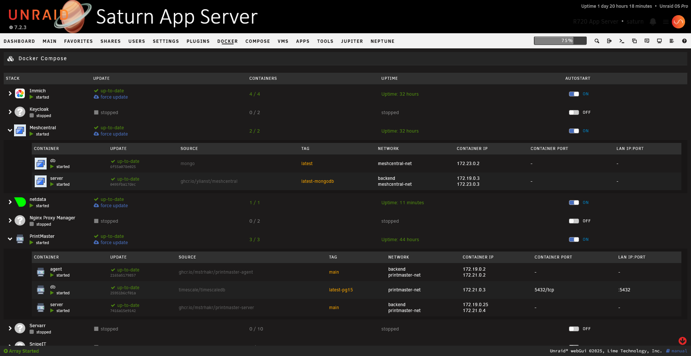
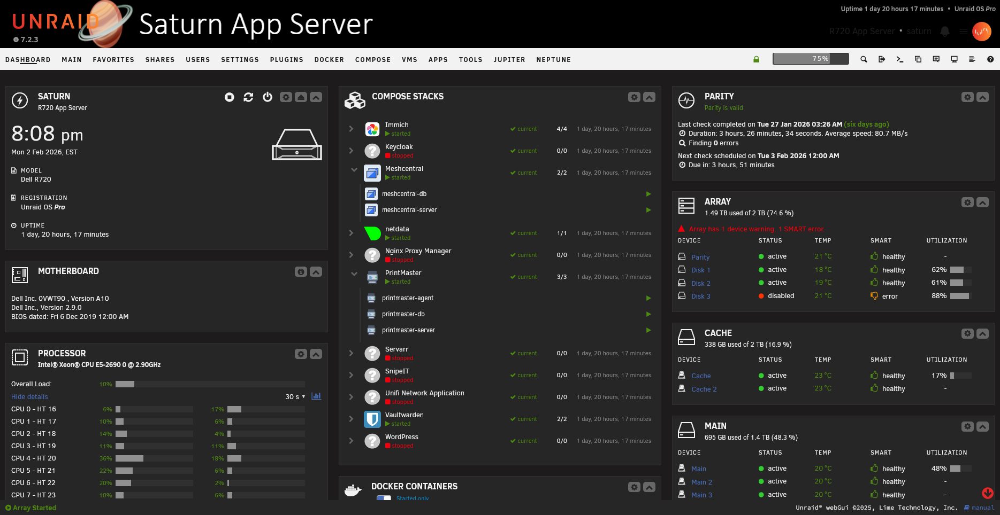
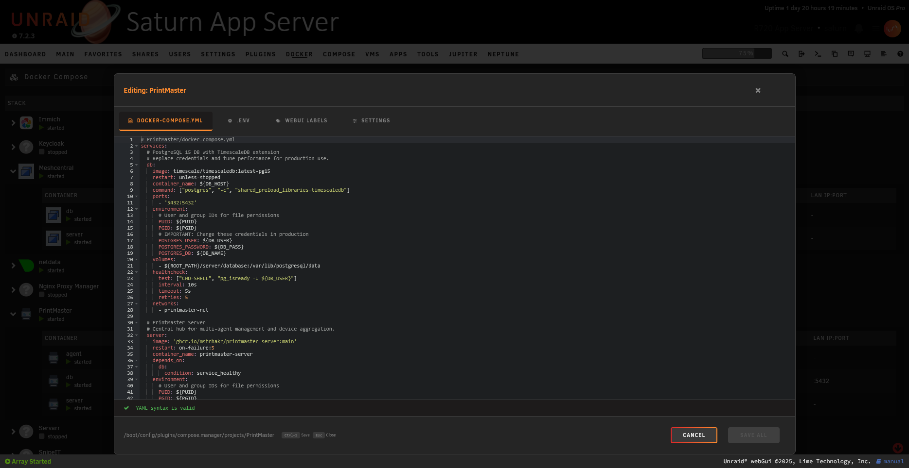
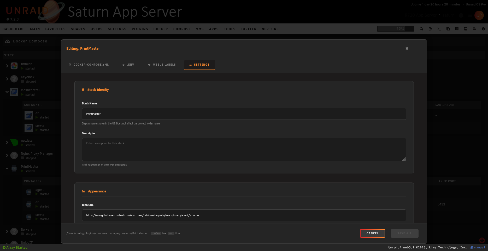
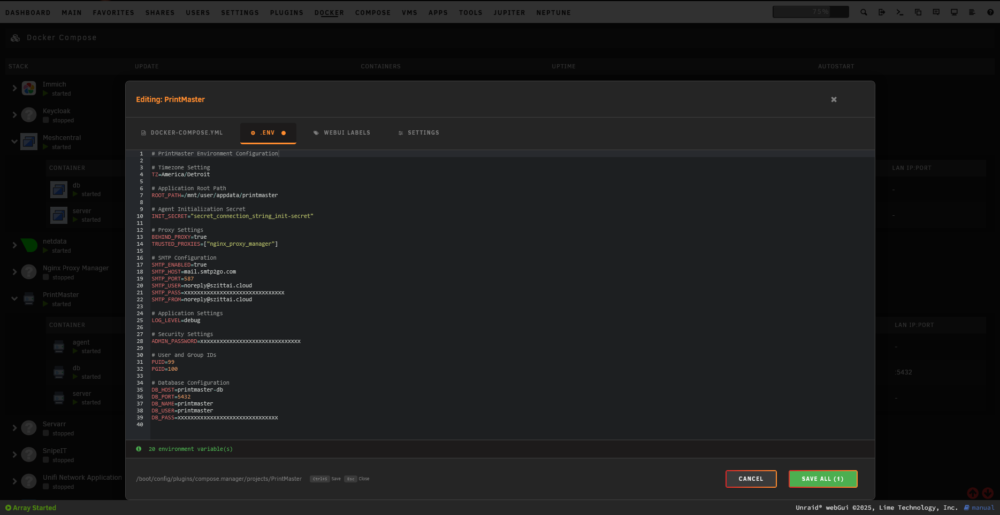
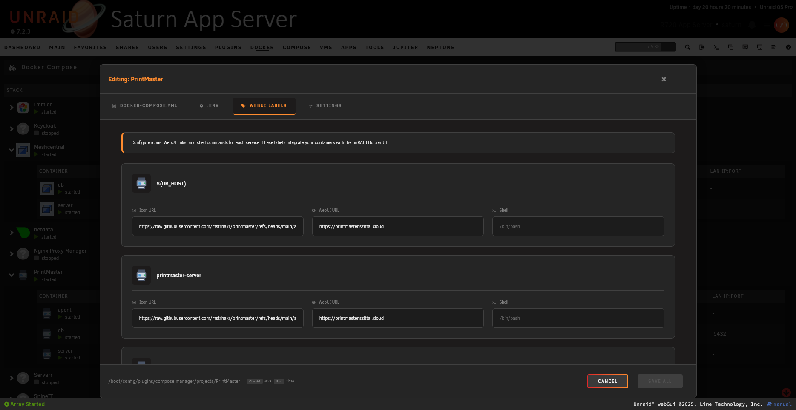

# Compose Manager

A plugin for [unRAID](https://unraid.net/) that installs Docker Compose and adds a management interface to the web UI.

## Screenshots

### Main Compose Manager Interface


### Dashboard Integration


### Stack Editor
The built-in editor provides multiple tabs for managing your compose stack:

| Compose File | Settings |
|:------------:|:--------:|
|  |  |

| Env | Web UI Labels |
|:---:|:-------------:|
|  |  |

## Features

- **Docker Compose Integration** - Installs the Docker Compose CLI plugin on your unRAID server
- **Web UI Management** - Provides a user-friendly interface to manage your compose stacks directly from the unRAID dashboard
- **Stack Operations** - Start, stop, restart, update, and remove compose stacks with a single click
- **Autostart Support** - Configure stacks to automatically start when the array starts, with optional force recreate
- **Container Status** - View real-time status of containers within each stack (running, stopped, paused, restarting)
- **Environment Files** - Support for custom `.env` file paths per stack
- **Profiles Support** - Full support for Docker Compose profiles with auto-detection and default profiles
- **Editor Integration** - Built-in editor for docker-compose.yml files with syntax highlighting
- **Override Files** - Support for docker-compose.override.yml files
- **Indirect Stacks** - Reference compose files stored in alternate locations
- **Web Terminal** - Integrated terminal output via ttyd for compose operations
- **unRAID Web UI Integration** - Optional patches to integrate compose containers with the native Docker UI

## Installation

Install via the Community Applications plugin in unRAID, or manually install by navigating to:

**Plugins → Install Plugin** and entering the plugin URL:
```
https://raw.githubusercontent.com/mstrhakr/compose_plugin/main/compose.manager.plg
```

## Requirements

- unRAID 6.9.0 or later
- Docker service enabled

## Configuration

Settings can be accessed via **Settings → Compose** in the unRAID web UI:

| Setting | Description |
|---------|-------------|
| **Output Style** | Choose between terminal (ttyd) or basic output |
| **Projects Folder** | Location where compose project directories are stored (default: `/boot/config/plugins/compose.manager/projects`) |
| **Autostart Force Recreate** | Force recreate containers during autostart |
| **Show in Header Menu** | Display Compose Manager as a separate page in the header menu under Docker Compose |
| **Patch Web UI** | Enable integration patches for the native Docker manager UI |
| **Debug to Log** | Enable debug logging |

## Usage

### Creating a Stack

1. Navigate to **Docker → Compose** (or **Docker Compose** if header menu option is enabled)
2. Click **Add Stack**
3. Enter a name and optionally a description
4. Edit the docker-compose.yml file using the built-in editor
5. Click **Compose Up** to start the stack

### Managing Stacks

Each stack provides the following actions:
- **Compose Up** - Start the stack (with optional profile selection)
- **Compose Down** - Stop and remove containers
- **Update Stack** - Pull latest images and recreate containers
- **Edit Stack** - Modify the docker-compose.yml file
- **Remove Stack** - Delete the stack configuration

### Autostart

Enable autostart for a stack by clicking the autostart toggle. Stacks will automatically start when the unRAID array starts.

## Profiles

Compose Manager provides full support for [Docker Compose profiles](https://docs.docker.com/compose/profiles/), allowing you to selectively start services based on your needs.

### What are Profiles?

Profiles let you define groups of services in your `docker-compose.yml` that can be started together. Services without a profile are always started, while profiled services only start when their profile is explicitly activated.

### Example docker-compose.yml with Profiles

```yaml
services:
  # Always starts (no profile)
  webapp:
    image: nginx:latest
    ports:
      - "80:80"

  # Only starts with 'debug' profile
  debugger:
    image: busybox
    profiles:
      - debug
    command: sleep infinity

  # Only starts with 'monitoring' profile
  prometheus:
    image: prom/prometheus
    profiles:
      - monitoring
    ports:
      - "9090:9090"

  grafana:
    image: grafana/grafana
    profiles:
      - monitoring
    ports:
      - "3000:3000"
```

### Using Profiles in Compose Manager

#### Auto-Detection

When you save a compose file, Compose Manager automatically detects all defined profiles and stores them. These are displayed in the stack settings panel under "Available profiles".

#### Interactive Profile Selection

When you click **Compose Up**, **Compose Down**, or **Update Stack** on a stack that has profiles defined, a profile selector dialog appears allowing you to:
- **All Services (Default)** - Start all services including those with profiles
- Select a specific profile to activate only services assigned to that profile

#### Default Profiles for Autostart

Configure default profiles in the stack editor's **Settings** tab:

1. Click the stack icon to open the context menu
2. Select **Edit Stack**
3. Go to the **Settings** tab
4. In the "Default Profile(s)" field, enter one or more profile names (comma-separated)

**Example:** `production,monitoring` will activate both the `production` and `monitoring` profiles.

Default profiles are used for:
- **Autostart** - When the array starts, only services matching the default profiles will start
- **Start All Stacks** - Multi-stack operations use each stack's configured default profiles
- **Stop All Stacks** - Multi-stack stop operations respect default profiles

#### Profile Storage

Profiles are stored in the stack's configuration directory:
- `profiles` - JSON array of available profiles (auto-detected from compose file)
- `default_profile` - Comma-separated list of default profiles for autostart/multi-stack operations

### Profile Tips

1. **No profile = always starts**: Services without a `profiles` key start regardless of which profiles are activated
2. **Multiple profiles**: A service can belong to multiple profiles; it starts if any of its profiles are activated
3. **Comma-separated**: Specify multiple default profiles separated by commas (e.g., `dev,debug`)
4. **Empty = all**: Leave the default profile empty to start all services (equivalent to `--profile "*"` behavior)

## Support

- [GitHub Issues](https://github.com/mstrhakr/compose_plugin/issues)
- [unRAID Forums](https://forums.unraid.net/)

## License

This project is open source. See the repository for license details.

## Credits

Originally created by **dcflachs**. This fork maintained by **mstrhakr**.